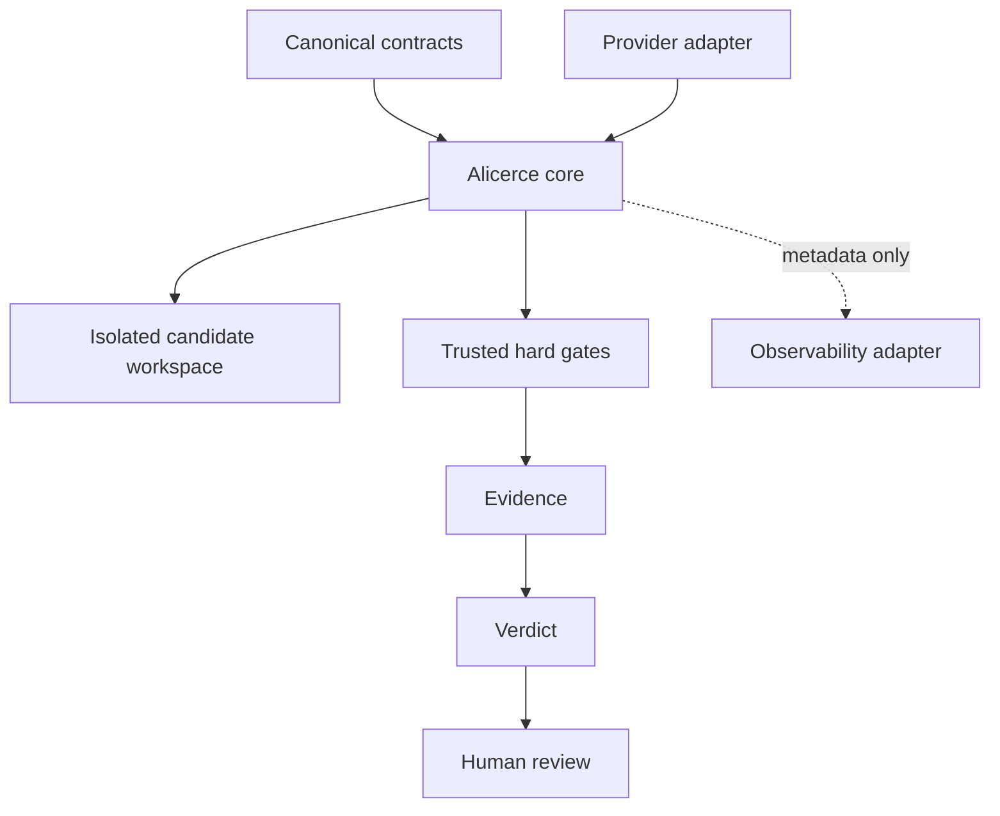

# Phase 2 Architecture Proposal

Status: Approved
Decision date: 2026-07-18
Decision gate: approved with recorded implementation prerequisites
Implementation authorized: Phase 2A only
Authorization date: 2026-07-19

## Purpose

Phase 2 introduces Alicerce as the vendor-neutral orchestration core for an
Evidence-Gated Engineering Loop. It turns the contracts and report-only
validation established in Phase 0-1 into a controlled execution model without
granting automatic merge or deployment authority.

This proposal defines boundaries and sequencing. It does not define a Python
package, install dependencies, change canonical schemas, or implement a runner.

## Sources of truth

| Concern | Authority |
| --- | --- |
| Contract, evidence, verdict, and builder-result shapes | `engineering-loop-schemas` |
| What was executed | `evidence.json` |
| Artifact integrity | SHA-256 recorded by canonical evidence |
| Technical acceptance | Contract-addressable hard gates |
| Final technical outcome | `verdict.json` |
| Run lifecycle and recovery | Alicerce state store |
| Operational diagnosis and distributed correlation | OpenTelemetry |
| Promotion, merge, and deployment | Human-controlled external workflow |

Telemetry is not evidence. A builder result is not a verdict. A successful
verdict makes a candidate eligible for human review; it does not promote it.

## Approved boundaries



The core owns orchestration, identities, budgets, state transitions, command
policy, evidence assembly, gate execution, verdict construction, and recovery.
It does not own provider-specific prompting, canonical schema definitions,
repository hosting, merge, deployment, or telemetry backends.

## Approved components

| Component | Responsibility |
| --- | --- |
| Contract Loader | Load and validate a pinned canonical contract before execution. |
| Run Identity | Create an immutable `run_id` and bind it to contract and baseline. |
| Workspace Manager | Prepare and validate an isolated candidate workspace. |
| Command Executor | Run allowlisted argv with timeout, bounded environment, and no implicit shell. |
| Budget Tracker | Enforce trusted counters and conservative reservations; reconcile advisory provider usage without treating it as authoritative. |
| Evidence Collector | Persist deterministic command and workspace facts with hashes. |
| Artifact Store | Persist immutable run artifacts, enforce storage policy, and coordinate bounded cleanup. |
| Gate Runner | Execute named hard gates from a trusted, pinned gate specification independently of the builder. |
| Verdict Builder | Derive status and final state from evidence and policy. |
| State Store | Persist monotonic transitions and resumable checkpoints. |
| Human Review Port | Produce a local review request without granting merge authority to the core. |
| Provider Port | Isolate builder/provider behavior from the domain. |
| Observability Port | Emit minimized operational metadata through a no-op or optional adapter. |

## Canonical final states

Alicerce must use the eight states already defined by
`engineering-loop-schemas v0.1.2` without renaming or extending them locally:

| State | Architectural use |
| --- | --- |
| `SUCCEEDED` | Hard gates passed; eligible for required human review. |
| `NO_OP` | No justified candidate work was required. |
| `NO_PROGRESS` | A candidate exists but does not improve the baseline. |
| `VERIFY_FAILED` | Candidate-related hard gates failed. |
| `POLICY_BLOCKED` | Scope or action policy was violated. |
| `BUDGET_EXCEEDED` | A configured hard resource ceiling was crossed. |
| `ESCALATED` | A human decision is required to resolve the run. |
| `INFRA_FAILED` | Infrastructure failed independently of candidate quality. |

Intermediate lifecycle states are internal persistence details and must never
be serialized as canonical final states without a future schema decision.

State semantics are normative in `engineering-loop-schemas`. The table above
reproduces the v0.1.2 meaning and does not redefine it locally. Earlier design
material also used `NO_PROGRESS` for repeated equivalent diffs or failure
signatures. Alicerce treats those as internal stall signals: they may support a
trusted finding that a candidate does not improve the baseline, but they do not
create a competing serialized state meaning. This alignment must be documented
upstream before Phase 2A implementation is authorized.

## Safety invariants

1. A builder never certifies its own work.
2. Every hard gate is mechanical, named, default-fail, and independently run.
3. Every run binds immutable contract, baseline, candidate, and environment
   identities before a verdict can be emitted.
4. Candidate work occurs outside the trusted baseline workspace.
5. Scope, action, network, command, and budget policies are enforced before and
   during execution.
6. Evidence storage is not writable through a builder tool boundary.
7. Missing or invalid evidence cannot produce `PASS` or `SUCCEEDED`.
8. Telemetry loss cannot rewrite evidence or candidate quality.
9. No Phase 2A component can merge, deploy, change branch protection, or mint
   repository credentials.
10. Resume logic revalidates identities and artifacts before continuing.
11. Every hard gate uses a trusted, pinned specification for its driver,
    protected configuration, acceptance criteria, and permitted candidate
    inputs; candidate content cannot replace or weaken that gate harness.
12. Active-run artifacts and evidence referenced by a verdict are never removed
    by automated cleanup.

## Observability

The first implementation must provide an `ObservabilityPort` and a no-op
implementation with no third-party dependency. A later optional adapter may use
`a2a-otel-kit>=0.4.2,<0.5` for Python 3.13 and 3.14.

Only allowlisted operational events are proposed:

```text
loop.run.started
loop.workspace.prepared
loop.builder.started
loop.command.completed
loop.gate.completed
loop.budget.exceeded
loop.verdict.decided
loop.human_review.requested
loop.run.completed
```

Attributes are limited to identifiers and low-sensitivity operational values,
such as `run_id`, `operation`, `duration_ms`, and `outcome`. Prompts, responses,
commands, stdout, stderr, diffs, evidence content, paths, credentials, and
personal data are excluded.

A central observability policy owns the event vocabulary, allowed attributes,
sensitivity classification, cardinality limits, context propagation, and
whether exception recording is permitted. Adapters cannot relax that policy.

## Delivery sequence

### Phase 2A — trusted local core

1. Approve this proposal and ADRs.
2. Define ports and immutable domain types.
3. Implement state persistence and run identity.
4. Implement isolated workspace and command execution.
5. Implement evidence collection, gates, and verdict construction.
6. Implement `ObservabilityPort` with only a no-op adapter.
7. Validate deterministic recovery and every canonical final state.
8. Exercise reservation, reconciliation, missing usage, delayed usage,
   understated usage, and exhaustion with a deterministic fake provider port.
9. Implement `ArtifactStore` against an explicit bounded retention policy.
10. Implement a local human-review adapter that produces a review request and
    performs no network or repository mutation.

### Phase 2B — optional integrations

1. Implement provider adapters without provider names in the domain.
2. Implement the optional `a2a-otel-kit` observability adapter.
3. Validate actual Collector receipt separately from core tests.
4. Add opt-in bootstrap integration to each harness in separate PRs.
5. Consider a schema reference to telemetry only after demonstrated need.

## Implementation prerequisites

The Design Gate is approved. Phase 2A implementation remains blocked until the
following decisions are recorded as testable acceptance criteria:

- repository and package boundaries;
- evidence authority and telemetry failure semantics;
- workspace isolation and command/network policy;
- state persistence, idempotency, and recovery rules;
- the initial human-review boundary;
- compatibility policy for optional adapters;
- artifact retention, cleanup ownership, per-run and global storage ceilings,
  full-storage behavior, and abandoned-run handling;
- trusted gate specifications and the classification of permitted candidate
  inputs for every initial hard gate;
- upstream documentation aligning `NO_PROGRESS` and internal stall signals;
- trusted counters, conservative reservations, and advisory provider usage;
- the exact Phase 2A acceptance test matrix.

## Explicitly deferred

- automatic merge, deployment, or release;
- remote multi-tenant execution;
- automatic activation for `agentic` governance profiles;
- schema changes for telemetry;
- provider-specific domain types;
- a mandatory OpenTelemetry Collector;
- Python 3.12 support for the proposed `a2a-otel-kit` adapter.
